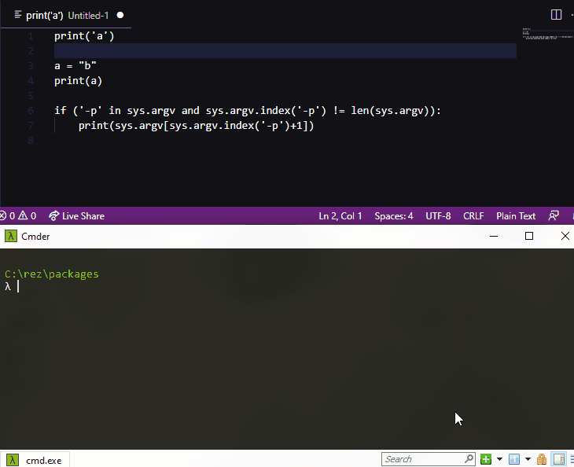

# ShellServer_vsc_extension

Visual Studio Code extension for this -> [ShellServer](https://github.com/OlivierArgentieri-rezpackages/shellServer) 

<p align="center">
  
</p>

## Get Started
Based on these shortcuts : 

``` ctrl+shift+e -> set port ```

``` ctrl+e+e -> send selected code to ShellServer ```
